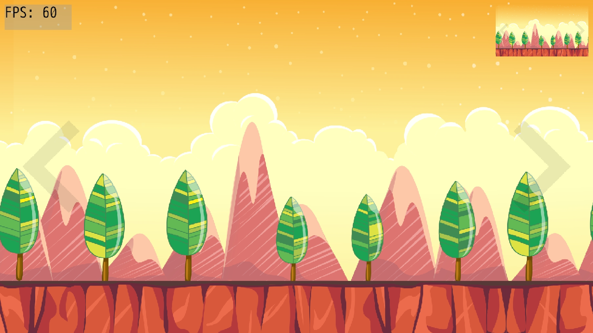

# A simple parallax with DragonRuby

So this is my first try at DragonRuby. I tried to make a parallax, which
I already did for a game with CSFML.

*Sorry for the recording quality. The parallax looks way better than that.*

The parallax code is in [lib/parallax.rb](lib/parallax.rb), and the code which controls it in [app/main.rb](app/main.rb). Other files control the two arrows you see on both sides of the screen; which you don't need if you just want to learn about the parallax.

## Show me the simplest working parallax

This code got a little tricky for a beginner, but you can still access [one of the first versions](https://github.com/TanguyAndreani/dragonruby-parallax/blob/cc71fa2777095b72925bd40bc8db95b9c251705a/app/main.rb) of the code. A single file parallax of less than twenty lines which just works.

## Credits

Images were found randomly on the web, they were free to use but I think
they need to be in the credits.
